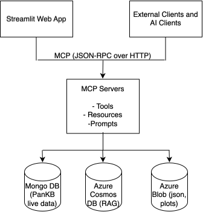
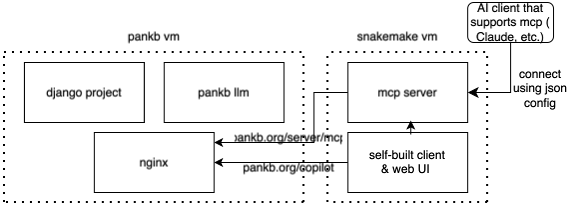

# PanKB Agent

An LLM agent that lets researchers explore the
[PanKB](https://pankb.org) microbial pangenome knowledgebase in natural
language. The agent orchestrates a custom MCP (Model Context Protocol)
server's tools — pangenome queries, charting, navigation, and a
RAG-backed literature search over 1011 open-access papers — behind a
Streamlit chat UI, with end-to-end Phoenix observability and a regression
eval harness.

## Project Background

PanKB is a comprehensive pangenome knowledgebase containing rich datasets
across genes, genomes, species and families, plus a curated bibliome of
pangenomic literature. However, users currently can only access pre-built
analyses through the web frontend, limiting custom exploration.

To address this, we built:

- an **MCP server** exposing PanKB's live data and a RAG endpoint over its
  bibliome as tools, and
- an **agent client** that drives an LLM tool-calling loop over those
  tools, served as a chat UI on the PanKB site and also reachable from any
  MCP-compatible client (Claude Desktop, ChatGPT, etc.).

Together they enable:

- **Flexible data access**: bring your own MCP client, or use the hosted chat
- **Natural language interaction**: query, visualize, and ask literature
  questions through plain language
- **Real-time results**: direct connection to the live PanKB database — no
  stale exports

## Stack

Python · FastMCP · OpenAI Responses API · Streamlit · OpenID Connect (Google)
· PostgreSQL · MongoDB · Plotly · VoyageAI embeddings · Cohere reranking ·
Arize Phoenix (tracing + evaluation) · OpenInference / OpenTelemetry · Docker
Compose · GitHub Actions · uv

## MCP System Architecture



## PanKB Overall Architecture



## Tools

### Query Tools
| Tool | Description |
|------|-------------|
| list_families | List (all or designated) microbial families with species/genome counts |
| list_species | List (all or designated) species with pangenome statistics (core/shell/cloud) |
| list_genomes | List (all or designated) genomes with GC content, length, and isolation info |
| list_genes | Search genes by name, function, or pangenomic class |
| get_stats | Get database-wide statistics |

### Navigation Tools
| Tool | Description |
|------|-------------|
| get_family_url | Link to a family page on pankb.org |
| get_species_url | Link to a species page with section options |
| get_genome_url | Link to an individual genome page |
| get_gene_url_with_species_specified | Link to a gene in a specific species |
| get_gene_url_with_species_unspecified | Search a gene across all species |
| get_search_url | General search on pankb.org |

### Chart Tools
| Tool | Description |
|------|-------------|
| plot_gene_frequency_histogram | U-shaped gene frequency distribution |
| plot_pangenome_class_distribution | Core/Accessory/Rare gene pie chart |
| plot_cog_category_distribution | COG functional category bar chart |
| plot_species_comparison | Compare pangenome composition across species |
| plot_genome_count_by_family | Genome counts per family bar chart |
| plot_gc_content_distribution | GC content histogram for a species |
| plot_geographic_distribution | Genome counts by country |
| plot_isolation_source_distribution | Isolation source pie chart |
| plot_phylogroup_distribution | Phylogroup bar chart |
| plot_phylon_heatmap | Phylon weight heatmap across genomes |
| plot_heaps_law | Pangenome growth curve (Heaps' law) |
| plot_cumulative_gene_frequency | Cumulative gene frequency curve |
| plot_gene_frequency_curve | Gene frequency distribution curve |
| plot_cog_by_gene_class | COG categories split by gene class |
| plot_gene_presence_absence_matrix | Gene presence/absence binary matrix |
| plot_dn_ds_ratio | Selection pressure (dN/dS) distribution |

### RAG Tool
> Toggle on the "Search Literature" switch in the sidebar first.

| Tool | Description |
|------|-------------|
| search_pangenome_literature | Search pangenome research papers via RAG (VoyageAI embedding + Cohere reranking) over a curated bibliome of 1011 open-access papers |


## Connection

1. Hosted client: <https://pankb.org/copilot/>
2. Server connection via Claude Desktop:
   ```jsonc
   // claude_desktop_config.json
   {
     "mcpServers": {
       "pankb": {
         "command": "npx",
         "args": ["-y", "mcp-remote", "https://pankb.org/server/mcp"]
       }
     }
   }
   ```

## Prompt Versioning

System prompts live as versioned modules under
[`ai_client/app/prompts/`](ai_client/app/prompts/) (e.g. `v1.py`, `v2.py`).
The active version is selected by the `PROMPT_VERSION` env var, with a
fallback to `DEFAULT_VERSION` in the registry.

The resolved version is stamped on every `agent.chat` span and every
Phoenix Experiment run.

## Observability

The agent emits [OpenInference](https://github.com/Arize-ai/openinference)
traces to a self-hosted Arize Phoenix instance bundled in
[docker-compose.yaml](docker-compose.yaml). The agent loop, LLM calls, and
every MCP tool invocation render as a single trace tree per user turn,
grouped by conversation in Phoenix's Sessions view. Open the UI at
<http://localhost:6006>.

## Evaluation

The agent is regression-tested against a versioned golden set using
Phoenix's native Datasets + Experiments workflow. The 15 cases in
[evals/golden_set.yaml](evals/golden_set.yaml) cover query, chart,
navigation, RAG, multi-step, and out-of-domain refusal behaviors. Runs
exercise the real production `MCPClient` (not a mock), tagged with the
active prompt version so prompt changes are diffable in the UI.

```bash
cd evals
PHOENIX_COLLECTOR_ENDPOINT=http://localhost:6006 \
MCP_SERVER_URL=http://localhost:8000/mcp \
uv run python run_evals.py
```

## Roadmap

- [x] initialize codebase, use uv for env control, follow microservice structure to separate server and client apps into two directories, but track them using one repo
- [x] write tools based on research papers, design tool categories
- [x] reuse previous RAG and add to tools
- [x] design and write prompts
- [x] write server app using FastMCP and uvicorn (to enable hot-reload for development), mount all server-side components
- [x] write client app, initiate client instance, import openai llm, write interaction loop between user, client, server and llm
- [x] write streamlit app, create session state to store conversation within sessions, design welcome messages to guide usage
- [x] write dockerfiles to containerize server and client, write docker-compose to orchestrate
- [x] add logs for both server and client apps
- [x] add CI/CD workflows and use self-hosted runner
- [x] design authorization methods for user-client (OpenID Connect via Google) and server-client (Bearer token)
- [x] design a panel on the streamlit front page to display past conversations and available tools
- [x] build a SQL database to store user info, token usage and conversation history
- [x] use nginx for reverse proxy, put client under PanKB's routing
- [x] add export function for PNG/SVG and CSV
- [x] set up a tracing and monitoring system using Arize Phoenix
- [x] design an evaluation workflow using Phoenix's built-in datasets and experiments
- [x] version system prompts via a git-tracked registry stamped on every trace
- [ ] gate prod deploy on the eval workflow (CI integration)
- [ ] add an LLM-as-judge evaluator alongside the deterministic one
- [ ] propagate OTel context into the MCP server so RAG retrieval is traced end-to-end
